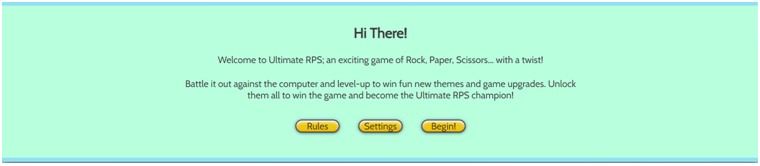
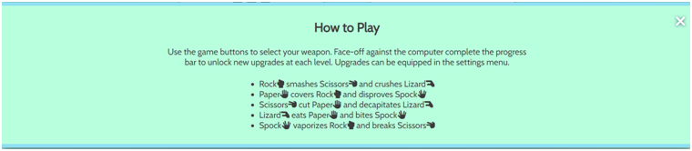
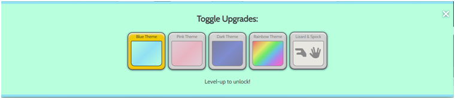
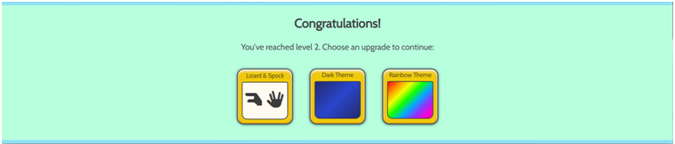

# Ultimate RPS

- Ultimate RPS is a fun game of Rock, Paper, Scissors which enhances the player's experience with the inclusion of unlockable upgrades. Upgrades include exciting new background colours and added choices of options Lizard and Spock! Play against the computer with increasing levels of difficulty and try to win in as few turns as possible.

## Links

[Link to the live project (right click to open in new tab)](https://beckyskel.github.io/javascript-project-2/)

[Link to the project repository (right click to open in new tab)](https://github.com/BeckySkel/javascript-project-2)

---
## Table of Contents
- [Strategy](https://github.com/BeckySkel/javascript-project-2/blob/main/README.md#strategy)
    - [Target Audience](https://github.com/BeckySkel/javascript-project-2/blob/main/README.md#target-audience)
    - [User Stories](https://github.com/BeckySkel/javascript-project-2/blob/main/README.md#user-stories)
- [Scope](https://github.com/BeckySkel/javascript-project-2/blob/main/README.md#scope)
    - [Research](https://github.com/BeckySkel/javascript-project-2/blob/main/README.md#research)
    - [Future Features](https://github.com/BeckySkel/javascript-project-2/blob/main/README.md#future-features)
    - [Testing](https://github.com/BeckySkel/javascript-project-2/blob/main/README.md#testing)
- [Structure](https://github.com/BeckySkel/javascript-project-2/blob/main/README.md#structure)
    - [Wireframes](https://github.com/BeckySkel/javascript-project-2/blob/main/README.md#wireframes)
    - [Information Architecture](https://github.com/BeckySkel/javascript-project-2/blob/main/README.md#information-architecture)
- [Skeleton](https://github.com/BeckySkel/javascript-project-2/blob/main/README.md#skeleton)
    - [Current Features](https://github.com/BeckySkel/javascript-project-2/blob/main/README.md#current-features)
    - [Technologies Used](https://github.com/BeckySkel/javascript-project-2/blob/main/README.md#technologies-used)
- [Surface](https://github.com/BeckySkel/javascript-project-2/blob/main/README.md#surface)
    - [Design](https://github.com/BeckySkel/javascript-project-2/blob/main/README.md#design)
    - [Deployment](https://github.com/BeckySkel/javascript-project-2/blob/main/README.md#deployment)
- [Credits](https://github.com/BeckySkel/javascript-project-2/blob/main/README.md#credits)
    - [Content](https://github.com/BeckySkel/javascript-project-2/blob/main/README.md#content)
    - [Media](https://github.com/BeckySkel/javascript-project-2/blob/main/README.md#media)
    - [Acknowledgemnets](https://github.com/BeckySkel/javascript-project-2/blob/main/README.md#acknowledgements)

---
## Strategy

### Target Audience
- The game is targeted towards children -> young adults, new to computer-gaming -> more experienced players. The site will primarily be used for entertainment purposes but can also be used by those who would like to learn the rules of the classic game of Rock, Paper, Scissors or the updated version of Rock, Paper, Scissors, Lizard, Spock.

### User Stories

#### Children/Newer Player
*These are younger users who perhaps are new to playing computer games but are looking for something fun and engaging.*
- As a child, I would like a simple but exciting layout and intuitive design.
- As a child, I wouldn't want to see too many long paragraphs or complicated instructions.
- As a child, I would like to receive positive feedback for progressing through the game and improving my skills.

#### Young-Adults/Experienced Player
*These are users who are likely to have some experience using internet browsers and playing comuter games.*
- As a young-adult, I would like the chance to customise my game to suit my unique style.
- As a young-adult, I would like familiar concepts and lay out so that I can easily navigate the site.
- As a young-adult, I would like a goal to work towards so that I can beat the game.

---
## Scope

### Research
- Before any planning, I conducted research into other similar games and took note of the rules and format, as well as which features I thought enhanced the player's experience and would be good to include for my target audiences.

### Future Features

#### Audio Feedback
- I'd like to include audio feedback of the result of each battle. Positive sounds for a win and negative sounds for loss. This would aid in communication the outcome of the battle to the player and would be especially useful to visually impaired players in particular. A toggle to turn audio on and off would be included in the settings menu.

#### Image Upgrade
- Another upgrade which could be included would be swapping out the [Font Awesome](https://fontawesome.com/) icons for photos/realistic images or other art-styles such as pixelated/retro.

#### Multiplayer
- I'd like to include online-play so that people from around the world can compete with each other 1 vs 1 matches or in knock-out tournaments. This would keep things interesting for the player and improve the replayability. 
- A local multiplayer option would be another desirable option. Players could use letter keys to select their weapon (e.g. a, s & d for player 1 and j, k & l for player 2).

### Testing
- Throughout the project, I relied heavily on [Chrome Devtools](https://developer.chrome.com/docs/devtools/) to help me view this project on different screen sizes so that I could adjust elements, create media queries for responsive design and debug JavaScript by logging outcomes to the console. 
- Please follow [this link](assets/documents/TESTING.md) for full list of tests carried out on this website

---
## Structure

### Wireframes
- After looking at common designs and features and deciding what I would like to include, I mapped out the intended features of the website using [Balsamiq](https://balsamiq.com/) to create wireframes of each page view.
- [View the wireframes here](assets/documents/wireframes.pdf)

### Information architecture
- Ultimate RPs is a single-page website which relies on JavaScript to manipulate the DOM and display different areas of the site in pop-up messages.
- The useful information is presented in an animated message container that slides in from the top of the screen and slides out through the bottom of the screen once the user has read the displayed information and interacted with the appropriate buttons. 
- The main game area is permanently displayed in the centre of the screen, tucked behind any displayed messages until the user is ready to resume playing. There are only 3 to 5 buttons to interact with but these manipulate various sections of the screen to display the user's choice, computer's choice, the outcome of the game and the amount of wins, losses and draws the user has achieved throughout their session.
- Once a player reaches the next level by incrementing the progress bar to fill the container, a message is displayed via the sliding message container letting the player know that they have leveled-up and offers them 3 upgrades to choose from. Once the player has chosen, the message slides out and the upgrade is applied.
- In the top right of the page is 2 buttons which call the settings menu where a player can enable and disable their unlocked upgrades, or the rules on how to play the game. Both icons temporarily disappear when a message is displayed to avoid overlapping messages.

---
## Skeleton

### Current Features

#### Header
- 

##### Logo
- 
- 

##### Navigation
- 
- 

#### Game Board
- 

##### Display Boxes
- 
- 

##### Weapon Select
- 
- 

##### Scoreboard
- 
- 

#### Message Container
- 
- 

##### Welcome Message
- 
- 

##### Rules Display
- 
- 

##### Settings Menu
- 
- 

##### Level-up Message
- 
- 

##### Completion Message
- 
- 

#### Backgrounds
- 
##### Blue Theme
- 

##### Pink Theme
- 

##### Rainbow Theme
- 

##### Dark Theme
- 

### Technologies used

#### Languages
- [HTML](https://en.wikipedia.org/wiki/HTML)
- [CSS](https://en.wikipedia.org/wiki/CSS)
- [Git](https://en.wikipedia.org/wiki/Git) for version control
- [JavaScript](https://en.wikipedia.org/wiki/JavaScript)

#### Other resources
- [Gitpod](https://www.gitpod.io/) to alter and manage website files
- [Github](https://github.com/) to create and store website files
- [Github Pages](https://pages.github.com/) to deploy site
- [Chrome Devtools](https://developer.chrome.com/docs/devtools/) to test site throughout process
- [Balsamiq](https://balsamiq.com/) to create wireframes
- [Coolors](https://coolors.co/) to choose a colour scheme
- [CSS Gradient](https://cssgradient.io/#:~:text=Gradients%20are%20CSS%20elements%20of,be%20in%20a%20background%20element.) to help with CSS gradients for website backgrounds
- [Google Fonts](https://fonts.google.com/) for the website font (Cabin)
- [Font Awesome](https://fontawesome.com/) used to add icons
- [Favicon.io](https://favicon.io/favicon-generator/) used to create favicon
- [Code Institute](https://codeinstitute.net/) fullstack developer course to learn how to create
- [W3Schools](https://www.w3schools.com/) for help with common coding issues
- [Am I Responsive?](https://ui.dev/amiresponsive) for device simulations

---
## Surface

### Design

#### Colour scheme

- The colour-scheme is vibrant but soft to provide a pleasing display without distracting from the game-play.
- For the upgrades, bolder colours and patterns were chosen to improve player customisation and feeling of reward and excitement.
- I used [Coolors](https://coolors.co/) to help pick a colour scheme and [CSS Gradient](https://cssgradient.io/#:~:text=Gradients%20are%20CSS%20elements%20of,be%20in%20a%20background%20element.) to help with coding the CSS gradients.
- There is a 135 degree angled gradient across all backgrounds ranging from more subtle to very striking.
- For the standard displa, the base colours are pale blue, mint green and a warm off-white with mustard and lime green acting as highlights.

#### Imagery
- There are currently no images used in this site.

#### Typography
- All text is in the Cabin font. It is a humanist sans which is clear and easily read at both larger and smaller font sizes. It’s classic-yet-modern style pairs well with the softer colours and rounded edges of the website.
- Sans serif has been used as the fallback option since it is the closest web-safe font.

#### Icons
- [Font Awesome](https://fontawesome.com/) icons were used for navigation buttons as well as for the main game display.

### Deployment
- This site was deployed on Github Pages, following the below steps:
    1. Acces the Github repository [here](https://github.com/BeckySkel/javascript-project-2)
    2. Navigate to the **Settings** tab (far right tab)
    3. Open the **Pages** information
    4. Select branch **main**
    5. Wait for site to deploy (this make take a few minutes) 
- Access the live site [here](https://beckyskel.github.io/javascript-project-2/)

---
## Credits

### Content
- Websites used for initial research:
     - 
     - 
     - 
- Issue with trying to display the chosen weapon icon by using code to map the index in an array solved with code from [Borislav Hadzhiev](https://bobbyhadz.com/blog/javascript-array-find-index-of-object-by-property)
- CSS Code for colourful 3D heading from [Mandy Michael](code for 3D effect from https://codepen.io/mandymichael/pen/VprZaq)
- Code for preloading style.css suggested by [Chrome Devtools](https://developer.chrome.com/docs/devtools/) Lighthouse feature
- 3D buttons inspired by [Arron Hunt](https://codepen.io/arronhunt/pen/WWOOeO) but heavily edited by myself to suit my design

### Media
- All icons from [Font Awesome](https://fontawesome.com/)
- All CSS gradients achieved with [CSS Gradient](https://cssgradient.io/#:~:text=Gradients%20are%20CSS%20elements%20of,be%20in%20a%20background%20element.)

### Acknowledgements
- [Code Institute](https://codeinstitute.net/) for providing excellent learning content and project idea
- Reuben Ferrante as my mentor and providing vital feedback throughout the project's development
- [W3Schools](https://www.w3schools.com/) for quick and easy guidance on HTML and CSS
- The users of [Stack Overflow](https://stackoverflow.com/) for asking and answering some of the harder JavaScript questions
- Other CI students for sharing their work and providing inspiration and guidance

---

Becky Skelcher 2022